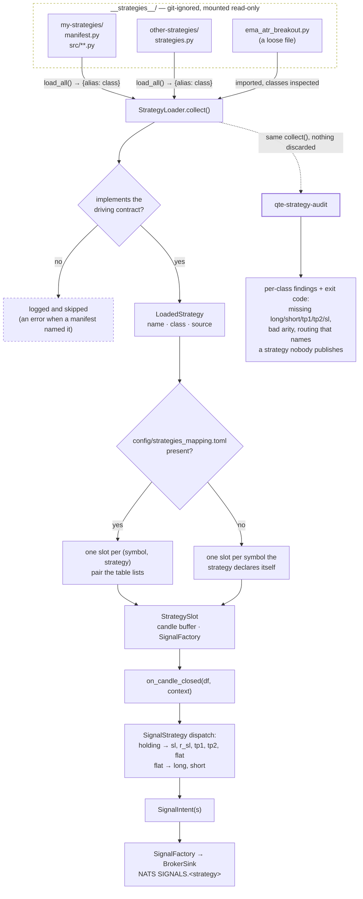

# Quant Trading Engine (QTE)

An event-driven framework for developing, backtesting and running quantitative
trading strategies. The engine is public; **your alpha is not** — strategies
live in `__strategies__/`, which is git-ignored here and cloned from your own
private repository at deploy time.

QTE ingests market data from a pluggable provider (Tiingo ships with it, and
a dev-only simulator you drive by hand),
keeps hot state in Redis, audits every
signal into PostgreSQL, and publishes trade signals over NATS
to [`algo-trading-broker`](https://github.com/rockingrow/algo-trading-broker),
which fans them out to MT5 / Binance workers.

```
provider ─▶ data-ingestion ─▶ Redis (hot state)
                    │
                    └─▶ NATS  QTE.candle.closed.<symbol>.<tf>
                                       │
                            strategy-runner ──▶ __strategies__/*.py
                                       │       (paired by config/strategies_mapping.toml)
                                       │
                    ┌──────────────────┴──────────────────┐
                    ▼                                     ▼
      NATS SIGNALS.<strategy>                   PostgreSQL (audit, JSONB)
      (algo-trading-broker JetStream)
                    │
                    ▼
             MT5 / Binance workers
```

---

## Core concepts

**Event-driven.** Nothing blocks anything. Ingestion pushes; the runner reacts
to a candle close; the broker takes signals off a durable stream. A slow
Postgres delays a log line, never a trade.

**Write once, run anywhere.** A strategy presents one method per broker action
— `long`, `short`, `tp1`, `tp2`, `sl`, plus an optional `r_sl` and `flat` — and
returns `SignalIntent` objects. The backtest replay and the live runner drive
that same interface with the same indicator code, so the file that produced a
backtest curve is the file that trades.

**Plugin / blackbox strategies.** The engine never contains an edge. It loads
strategies out of `__strategies__/` by file path — a mounted volume, not an
installed package — so the public engine and your private algorithms are
versioned and released independently. The contract is *structural*: a strategy
repo is free to restate `SignalStrategy` and `SignalIntent` on its own side so
it can build and test with this repo nowhere in sight, and the engine adapts
what it gets back at the boundary. `qte-strategy-audit` is what holds that
freedom to a standard: it checks every class the directory publishes against
the signal interface and refuses a deploy that would trade something
half-written.

---

## Quick start

```bash
git clone https://github.com/rockingrow/quant-trading-engine
cd quant-trading-engine

cp .env.example .env          # fill in QTE_TIINGO__API_KEY at minimum
make install-dev              # uv sync

# Try the pipeline with the example strategy. __strategies__/ does not exist
# in a fresh clone — it is left out of git so `git clone <your repo>
# __strategies__` has an empty destination to land in.
mkdir -p __strategies__
cp examples/__strategies__/ema_atr_breakout.py __strategies__/

make routing                  # config/strategies_mapping.toml from the template (git-ignored)
make audit                    # check what __strategies__/ publishes before running it

make infra                    # redis + postgres + nats
make db-upgrade               # create the schema (Alembic owns it, not an init script)
make download                 # provider history → data/parquet/*.parquet
make backtest STRATEGY=QTE_EXAMPLE_EMA_ATR SYMBOL=XAUUSD
```

To rehearse the *live* path instead — with no vendor key and no market open —
set `QTE_MARKET_DATA__PROVIDER=simulator` and drive the feed yourself:

```bash
make sim                      # terminal 1: the dev websocket feed
make ingestion                # terminal 2
make runner                   # terminal 3

qte-simulator replay --symbol XAUUSD --generate 300 --seed 7 --verify
# → 300/300 candles republished by ingestion
```

[`docs/simulator.md`](docs/simulator.md) is the step-by-step.

Requires Python 3.13, [uv](https://docs.astral.sh/uv/), and Docker. The
version is pinned rather than a floor: the runner imports the strategy
plugins into its own process, and `pandas-ta` — which they use — needs
≥ 3.12 and pins a `numba` with no 3.14 wheel. See `pyproject.toml`.

---

## Layout

| Path | What it is |
| --- | --- |
| `engines/shared/src/qte_shared/` | — models, indicators, `StrategyBase`, NATS/Redis/Postgres adapters, the plugin loader, the signal factory, `interfaces/` (the contracts engines program against) and `providers/` (the market data vendors behind them). Every other engine depends on this and on nothing else in the repo. |
| `engines/data_ingestion/src/qte_ingestion/` | Provider live feed → resampler → Redis + NATS. |
| `engines/backtest_engine/src/qte_backtest/` | History downloader, parquet store, replay loop, fill simulator, metrics, reports, `qte-backtest` CLI. |
| `engines/strategy_engine/src/qte_strategy_engine/` | The live runner: plugin loading, the NATS event loop, delivery to the broker, audit, and the `qte-control` operator CLI. |
| `engines/market_simulator/src/qte_simulator/` | **Dev only.** A WebSocket feed you drive by hand, so the whole pipeline can be rehearsed with no market open. Refuses to start unless `QTE_ENV=dev`. `qte-simulator`; see [`docs/simulator.md`](docs/simulator.md). |
| `engines/strategy_audit/src/qte_strategy_audit/` | The deploy gate: validates every strategy in `__strategies__/` against the QTE signal contract and cross-checks the routing table. `qte-strategy-audit`. |
| `__strategies__/` | **Git-ignored and untracked.** Your private strategy repo, cloned in whole — its own lockfile, its own tests, its own release cycle. Absent from a fresh checkout by design. |
| `config/` | `strategies_mapping.example.toml` — the symbol → strategies table's schema. The real `strategies_mapping.toml` beside it is git-ignored. Also the standalone NATS config. |
| `migrations/` | Alembic. One chain for the whole system; `env.py` imports every engine's models. |
| `deploy/` | The strategy requirements `make strategy-requirements` freezes for the image build. |
| `data/reports/` | Backtest reports, JSON + Markdown. Git-ignored. |
| `examples/__strategies__/` | A worked example of the plugin contract. Not an edge. |

---

## Writing a strategy

A strategy presents **one method per broker action**. Five are required —
`long`, `short`, `tp1`, `tp2`, `sl` — and two are optional: `r_sl` (re-stop:
break-even or trailed) and `flat` (a close that is neither a target nor a stop).

```python
from qte_shared.indicators import atr, crossover, ema
from qte_shared.models import SignalAction
from qte_shared.strategy_base import SignalIntent, SignalStrategy


class MyEdge(SignalStrategy):
    name = "MT5_GOLD_M15_V1"  # ← the NATS subject workers subscribe to
    symbols = ("XAUUSD",)  # ← a default; config/strategies_mapping.toml overrides it
    timeframe = "M15"
    warmup = 220

    def long(self, df, context):
        fast, slow = ema(df["close"], 21), ema(df["close"], 55)
        if not bool(crossover(fast, slow).iloc[-1]):
            return None

        close = float(df["close"].iloc[-1])
        risk = float(atr(df, 14).iloc[-1]) * 1.5
        return SignalIntent(
            action=SignalAction.LONG,
            price=close,
            quantity=0.01,
            sl=close - risk,
            tp1=close + risk * 1.5,
            tp2=close + risk * 3,
            tp1_percent=50.0,
            move_sl_to_be=True,
        )

    def short(self, df, context):
        return None

    # The bracket travels with the entry and the broker's worker manages the
    # exits, so there is nothing to decide per bar. Saying so in three lines is
    # the point of the interface — the alternative is a reader inferring it
    # from an absence and never being sure they inferred right.
    def tp1(self, df, context):
        return None

    def tp2(self, df, context):
        return None

    def sl(self, df, context):
        return None
```

### Why methods rather than one big branch

`on_candle_closed` still exists — it is what the engine actually calls — but
`SignalStrategy` implements it for you, by asking the seven methods in a fixed
order:

| Position | Methods asked | Rule |
| --- | --- | --- |
| Holding (`context.open_uxid` set) | `sl` → `r_sl` → `tp1` → `tp2` → `flat` | every one is asked; taking `tp1` and trailing the stop on one bar is normal |
| Flat | `long` → `short` | the first that answers wins — a bar cannot be both |

The stop is asked before any target: if one bar both stopped out and reached a
target, the stop is what happened. A method that returns somebody else's action
— a `tp1()` returning a `SHORT` — raises rather than reaching the broker as a
valid-looking payload.

Override `on_candle_closed` yourself if you need a different order. The seven
methods stay the published surface either way, and that surface is what
`qte-strategy-audit` reads and what `describe()` reports.

### Rules the framework enforces so you do not have to

- `df` is an OHLCV frame indexed by candle **open time** in UTC, oldest first,
  and its last row is always a **closed** bar. It never contains a future bar.
- `name` must match the strategy the broker's workers are configured for — it
  *is* the NATS subject they subscribe to. Two strategies sharing a name is a
  loud error at load time and a hard failure in the audit.
- You never publish anything. Return intents; the runner attaches the bracket,
  mints/reuses the trade-cycle id, sends, and audits.
- `on_tick(price, ctx)` is optional. Override it only when an exit has to react
  faster than a bar close — the runner subscribes to ticks only if something does.

`df` holds `history_window()` bars — `max(warmup * 2, 400)` by default, or
whatever `max_history` you set. **The live runner uses the same number**, so a
strategy that reads the whole frame (a running sum, a session VWAP) computes the
same thing in both places. Set `max_history = 0` for everything available, but
note that "available" is the whole parquet file in a backtest and only what
Redis retained after a restart — the runner warns when the two cannot match.

---

## How strategies are found



Two ways in, and the loader prefers the first.

### A manifest — for a strategy repository

A plugin repo declares itself by putting a `strategies.py` — or `manifest.py`,
the loader takes either — at its root, exposing `load_all()` returning
`{alias: strategy class}`:

```python
# __strategies__/my-strategies/manifest.py
import sys
from pathlib import Path

sys.path.insert(0, str(Path(__file__).resolve().parent / "src"))

from mine.gold.m5 import GoldEdge

ALIASES = {"MT5_GOLD_M5_V1": GoldEdge}


def load_all():
    return dict(ALIASES)
```

The engine imports that one file and asks it what exists. Nothing on this side
then knows a module path, a package name or a directory layout — so the plugin
repo reorganises itself freely, and it decides which of its classes are
deployed. A half-finished experiment sitting in the tree cannot start trading
because someone forgot it was a strategy subclass.

The manifest may sit at the root of `__strategies__/` or one level below it,
which is what `git clone <repo> __strategies__/<name>` produces.

**A manifest repo need not import `qte_shared` at all.** The engine recognises
a strategy structurally — a concrete `on_candle_closed`, a `name`, a
`history_window()` — and converts the intents it returns into its own models
(`qte_shared.strategy_base.coerce_intent`). Restating the contract on the
plugin's side is what lets that repo run its own lint, test and release cycle
with this one nowhere in sight. The audit reads it the same way, so a repo that
restates `SignalStrategy` is still checked for all seven signal methods.

**Its dependencies are not automatic.** The plugins are imported into the
runner's process, so whatever they need has to be installed alongside the
engine:

```bash
make strategy-deps          # into this venv, from the plugin repo's lockfile
make strategy-requirements  # freeze into deploy/ for the image build
make strategy-test          # run the plugin repo's own suite
make strategies             # list what the engine can see
make audit                  # check that what it sees is fit to trade
```

`make up` runs the freeze for you before building.

### A directory scan — for a single file

Failing a manifest, every `.py` under the directory is imported and anything
that looks like a strategy is collected. Drop
`examples/__strategies__/ema_atr_breakout.py` in and it runs, no ceremony. The
two mix: a scan still covers loose files alongside a cloned repo that brought
its own manifest.

The scan walks recursively, so a subfolder per instrument is fine. Because the
directory may be a whole cloned repo rather than a tidy folder, it skips hidden
directories (`.git`, `.venv`, …) and the usual repo furniture — `tests/`,
`docs/`, `build/`, `node_modules/` and friends
(`qte_shared.plugin_loader.EXCLUDED_DIRECTORIES`). Files starting with `_` are
skipped too, so shared helpers live in `_helpers.py`. A file that fails to
import is logged and skipped: one broken strategy does not stop the others.

### The two contracts, and why there are two

| | `StrategyBase` | `SignalStrategy` |
| --- | --- | --- |
| What it is | what the engine **drives** | what a strategy **presents** |
| Surface | `on_candle_closed`, `on_start`, `on_stop`, `history_window` | `long`, `short`, `tp1`, `tp2`, `sl`, `r_sl?`, `flat?` |
| Enforced by | the loader, at boot — skip what it cannot drive | `qte-strategy-audit`, at deploy — fail on what is missing |

`StrategyBase` is small on purpose: a plugin repo has to be able to restate it,
so anything added there is something every private repo must copy. The signal
interface is where the requirements live, and it is checked by a tool you run
rather than by the process that is trying to trade — a half-migrated repo still
backtests.

---

## Pairing symbols with strategies

Which strategies trade which symbols lives in **`config/strategies_mapping.toml`**, not in
the code:

```toml
[symbols.XAUUSD]
strategies = ["MT5_GOLD_M15_V1", "MT5_GOLD_M5_SCALP"]

# Per-pair overrides. They beat QTE_RUNNER__STRATEGY_PARAMS, so one strategy
# can run tighter on gold than it does on everything else.
[symbols.XAUUSD.params.MT5_GOLD_M15_V1]
risk_percent = 1.0

[symbols.BTCUSDT]
strategies = ["MT5_GOLD_M15_V1"]

# Parks a symbol without deleting its configuration.
[symbols.EURUSD]
enabled = false
strategies = ["MT5_FX_M15_V1"]
```

```bash
make routing   # cp config/strategies_mapping.example.toml config/strategies_mapping.toml (never overwrites)
make audit     # verify every name in it against what __strategies__/ publishes
```

**The real file is git-ignored; `config/strategies_mapping.example.toml` is not.** What you
trade, and at what risk, is position information and this repo is public — so
the schema stays reviewable in history while the book does not. Keep the two in
step: a key only in the real file is one nobody can review. Point
`QTE_ENGINE__ROUTING_FILE` elsewhere to mount it as a secret in production;
compose already mounts `./config` read-only into both service containers.

Why a TOML file rather than environment variables: this is a matrix — symbol ×
strategy × parameters — and flattening a matrix into `QTE_ROUTING__XAUUSD_0` is
how it stops being reviewable. TOML rather than YAML because `tomllib` is in the
standard library and this file is parsed inside the trading process.

**With no file at all nothing breaks.** Each strategy falls back to its own
`symbols` attribute, or to `QTE_ENGINE__SYMBOLS` when it declares none — the
behaviour that existed before the table did. A file that exists but routes
nothing means *trade nothing*, which is a different thing and is treated as one.

The runner builds one instance per `(symbol, strategy)` pair, so a strategy
carrying state between bars never has gold's last bar deciding what happens on
bitcoin's next one. A name in the table that nobody publishes is logged as an
error at boot, because the symptom otherwise is a symbol that quietly trades
nothing — which reads exactly like a strategy that found no setups.

---

## Auditing what you cloned in

The loader is forgiving by design: what it cannot drive it logs and skips, so
one broken file does not stop the other four. That is right for a running
process and useless as a deploy check — "skipped" and "there were none" read
identically in a log until the P&L does not arrive.

`qte-strategy-audit` is the strict pass over the same directory:

```bash
make audit                              # human-readable, fails on errors
make audit-strict                       # warnings fail too — what CI should run
uv run qte-strategy-audit --format json # for anything that has to act on it
uv run qte-strategy-audit --format markdown  # for a pull request
docker compose run --rm strategy-audit  # the same, in the deployed image
```

```
Strategy audit - /app/__strategies__
Routing table  - /app/config/strategies_mapping.toml

  [FAIL] MT5_GOLD_M15_V1  (GoldEdge, via manifest)
         /app/__strategies__/my-strategies/manifest.py
         signals: long, short, tp1, sl
         FAIL MT5_GOLD_M15_V1.tp2: required signal method tp2() is not implemented
              -> def tp2(self, df, context) -> IntentResult: return None - an explicit
                 'never' is an answer; an absence is not

1 strategies, 1 errors, 0 warnings
```

What it checks, and why each one is worth a deploy failing over:

| Finding | Severity | Otherwise you find out |
| --- | --- | --- |
| `load-failed` | error | as "0 strategies" in a log — a green deploy that trades nothing |
| `missing-signal-method` | error | never — the action simply cannot be emitted |
| `signal-method-arity` | error | on the first bar that reaches the hook, possibly weeks in |
| `undrivable` | error | as a line in a log saying the strategy was skipped |
| `not-instantiable` | error | as a traceback at boot, with the market open |
| `bad-timeframe`, `bad-warmup` | error | at boot, or as indicators running on a half-warm window |
| `duplicate-name` | error | as two algorithms closing each other's positions |
| `ambiguous-manifest` | error | as whichever alias table the lookup order happened to pick |
| `routed-to-nothing` | error | as a symbol that trades nothing and looks like patience |
| `routing-unreadable` | error | as the runner failing to start |
| `unrouted-strategy` | warning | never — usually the forgotten half of a rename |
| `no-manifest` | warning | as an experiment in the tree that started trading |
| `unnamed` | warning | as signals on a subject nobody configured a worker for |

Every finding carries a `fix`. The exit code is the product; everything else is
there so a human can see what the exit code meant.

### The same audit, on every start

CI and `make audit-strict` are the deploy gate, and both of them look at the
directory *once*. `__strategies__/` is a bind mount that can be pulled, edited
or emptied afterwards, and the runner restarts on its own — so the runner also
audits its own book, in its own process, immediately before it loads anything:

```bash
QTE_RUNNER__AUDIT_ON_START=warn      # log the report, start anyway (default)
QTE_RUNNER__AUDIT_ON_START=error     # refuse to start when the audit found errors
QTE_RUNNER__AUDIT_ON_START=strict    # refuse on warnings too — `make audit-strict`
QTE_RUNNER__AUDIT_ON_START=off       # don't
```

`warn` is the default because it changes nothing about which strategies run: the
loader still skips what it cannot drive, and the report is only there to make
that skipping visible instead of silent. Turning it up to `error` trades a
degraded book for a stopped one — the right call when a half-populated book is
worse than none, the wrong one when four strategies trading beats zero.

This is deliberately *not* a `depends_on: strategy-audit` in compose. That would
gate on a container which has already exited successfully — it answers the
question when the stack first came up and never again — and it would hang the
whole stack, `data-ingestion` included, on a defect in code ingestion never
imports. A strategy problem should stop the one service that has strategies.

---

## Backtesting

```bash
uv run qte-backtest download --symbol XAUUSD --timeframe M15 --start 2023-01-01
uv run qte-backtest list
uv run qte-backtest run --strategy MT5_GOLD_M15_V1 --symbol XAUUSD \
    --spread 0.30 --commission 0.02 --quantity 0.01 --persist
```

The simulator is deliberately pessimistic — it is meant to disprove a strategy,
not flatter one:

- entries and exits cross the spread and pay slippage;
- when a bar's range covers both the stop and the target, the **stop** is taken
  (without tick data there is no ordering, and assuming the good one is how a
  losing strategy backtests profitably);
- a gap through a level fills at the bar's open, not at the level;
- a second entry while a position is open is **rejected**, mirroring the
  worker, which answers `REJECTED` rather than stacking positions;
- a position still open on the last bar is marked out, so unrealised P&L cannot
  quietly flatter the report.

`--persist` writes the run and every trade into Postgres (`backtest_runs`,
`backtest_trades`).

### The report

`--report` writes a JSON artefact for an agent to analyse plus a Markdown
companion for a human — same object, two renderings:

```bash
uv run qte-backtest run --strategy MY_EDGE --symbol XAUUSD --report
# → data/reports/MY_EDGE_XAUUSD_M15_20260823T150404Z.{json,md}
```

Beyond the headline metrics it carries what makes a result diagnosable: every
statistic in **R-multiples** as well as currency, **MAE/MFE per trade** (how far
price went against and for the position while it was open), each partial exit
leg, the exact broker payloads the run would have published, and a
`reading_guide` block spelling out the conventions an agent would otherwise
guess at.

The part worth having is `diagnostics` — a rule set that reads the finished run
and says what is wrong with it. Each finding states the threshold it tripped,
carries the numbers that tripped it, and proposes one concrete change:

```
Diagnostics       2 critical, 1 info
  [CRITICAL] EXITS_NEVER_TRIGGER: 1/1 exits were forced by the end of the data
             → Print entry, sl, tp1 and tp2 for the first trade and check the
               distances against the instrument's typical bar range. A stop
               should be a small multiple of ATR, not a multiple of price.
```

`report.is_trustworthy` is false whenever anything critical fired, so an agent
knows to stop reading the metrics as meaningful. The rule table and the JSON
schema are in [`docs/backtest-report.md`](docs/backtest-report.md).

---

## Rehearsing the live path (dev only)

The backtest replays history through a strategy. It does not exercise the
socket, the resampler, Redis, NATS, the runner's warm-up, or the broker sink —
which is most of what runs in production and all of what breaks at 3am.

`qte-simulator` is a WebSocket server that speaks a market feed. `data-ingestion`
connects to it exactly as it connects to a vendor, so the pipeline under test is
the real one and only the prices are invented:

```bash
QTE_MARKET_DATA__PROVIDER=simulator   # the whole switch

make sim                              # the feed
qte-simulator tick   --symbol XAUUSD --bid 2400.0 --ask 2400.4
qte-simulator bar    --symbol XAUUSD --open 2400 --high 2412.5 --low 2396.25 \
                     --close 2408.75 --verify
qte-simulator replay --symbol XAUUSD --generate 300 --seed 7 --verify --expect-signal
qte-simulator walk   --symbol XAUUSD --rate 5
```

A bar is not published as a candle — it is expanded into the four ticks a bar is
made of, and ingestion's own resampler rebuilds it. `--verify` then subscribes to
`QTE.candle.closed.<symbol>.<tf>` and compares what came back, field by field,
exiting non-zero on a mismatch:

```
Played 300 XAUUSD M15 bars as 1201 ticks → 1 feed client(s)

Verify  300/300 candles republished by ingestion
Signals 1 emitted on XAUUSD
  QTE_EXAMPLE_EMA_ATR LONG price=2525.638811 qty=0.01 sl=2504.94991 [shadow]
```

**It refuses to run outside `QTE_ENV=dev`, and so does the provider that reads
it.** Not a comment or a naming convention — `qte_shared.dev_only.require_dev_env`
is called before the server binds a port and before the provider is constructed,
with no override flag. A simulator looks exactly like a feed, so an engine wired
to one in production would trade fabricated prices and log nothing unusual doing
it; the refusal has to sit where the wiring happens.

`docker-compose.yml` keeps it behind the `dev` profile (`make sim-up`), because
starting it *alongside* a real feed gives one symbol two sources and the
resampler drops whichever tick arrives second.

The step-by-step — including how bars are placed on the clock, why that is not
cosmetic, and what to check when a candle does not arrive — is
[`docs/simulator.md`](docs/simulator.md).

---

## Sending signals to the broker

QTE emits exactly the payload `algo-trading-broker` validates — its
`WebhookPayload`: `strategy`, `symbol`, `timeframe`, `timestamp`,
`signal_uxid`, a `position` block, `indicators`, `inputs`, `token`. Two
transports carry it, selected with `QTE_BROKER__TRANSPORT`:

| | `nats` (default) | `http` |
| --- | --- | --- |
| Destination | JetStream `SIGNALS.<strategy>` | `POST /secret/webhook` |
| Why | The broker's own webhook endpoint writes to that same stream and its `SignalWorker` consumes it — we inherit its persistence, retry and de-duplication with no HTTP hop in the trade path. | Slower, but it is the path that verifies the `token` field. |
| Auth | Access to the NATS cluster **is** the authentication — the token is not checked on this path. | `QTE_BROKER__TOKEN`, matched against the broker's. |
| Use when | QTE and the broker share a trusted/private NATS cluster. | Anything crosses a boundary you do not control. |

Each publish carries a fresh `Nats-Msg-Id`, so a retried publish inside the
stream's duplicate window is stored once and a worker opens one position.

`signal_uxid` is the **trade cycle**: an entry mints it and every TP/SL/FLAT
that follows reuses it, which is how the broker groups a whole trade into one
broadcast. The runner keeps it in Redis, so a restart mid-trade still closes the
position it opened.

> The engine also mirrors every emitted signal on `QTE.signal.emitted` and rows
> it into Postgres, whether it was delivered, shadowed or failed.

---

## Operating a running engine

There is no web service. The one control that genuinely has to reach a *running*
process is shadow mode — the live/paper switch, which must not require
restarting a runner mid-position — and that travels on NATS like every other
engine event:

```bash
uv run qte-control shadow status   # is it paper or live right now?
uv run qte-control shadow on       # pause delivery to the broker
uv run qte-control shadow off      # GO LIVE — prompts unless you pass --yes
uv run qte-control ping            # which runners are up, and in what mode
```

The flag is written to Redis first and broadcast second, so a runner that starts
*after* the broadcast still comes up in the mode you last chose. If NATS is
unreachable the command says so explicitly rather than reporting success —
"stored, but the process running right now did not hear it" is a different
outcome from "applied".

Everything else the engine knows is a CLI command or a SQL query:

| Want | Do |
| --- | --- |
| What strategies are loaded | `ls __strategies__/`, or run a backtest — the loader logs each one it finds |
| Signal audit trail | `SELECT * FROM signals ORDER BY created_at DESC LIMIT 20` |
| One trade cycle end to end | `SELECT * FROM signals WHERE signal_uxid = '…' ORDER BY created_at` |
| Backtest a strategy | `uv run qte-backtest run --strategy … --symbol … --report` |
| Read a report | `data/reports/*.json` — the file an agent analyses |
| Rehearse the live path | `make sim`, then `qte-simulator replay --symbol … --generate 300 --verify` (dev only) |

## Database

Alembic owns the schema. There is no init script — one would only ever run on an
empty volume, which is exactly the case a migration tool exists to outgrow.

```bash
make db-upgrade                     # apply everything pending
make db-current                     # where is this database?
make db-revision M="add a column"   # autogenerate from model changes
make db-check                       # fail if the models have drifted
make db-downgrade                   # back out one revision
```

The DSN comes from `QTE_POSTGRES__DSN` through `migrations/env.py`; `alembic.ini`
deliberately does not set `sqlalchemy.url`, because two places to configure it is
one place for it to drift from what the engines actually connect to.

**Each engine owns the tables it writes**, with its models and repositories in
its own `db/` package:

| Package | Tables | Repository |
| --- | --- | --- |
| `qte_strategy_engine.db` | `signals` | `SignalRepository` |
| `qte_backtest.db` | `backtest_runs`, `backtest_trades` | `BacktestRepository` |
| `qte_shared.db` | `engine_events` | `EventRepository` |

`engine_events` sits in shared because every engine writes it and none owns it.
Ingestion has no `db/` package at all — it writes only that shared table, and
inventing a table to justify a folder would be the wrong way round.

They all share one `DeclarativeBase` (`qte_shared.db.base`). That is not
incidental: Alembic diffs the database against `Base.metadata`, so a model on a
different base would be invisible to autogenerate — its table would never be
created, and a later revision would see it in the database, fail to find it in
the metadata, and propose dropping it. For the same reason, adding an engine
that owns tables means adding its `models` import to `migrations/env.py`.
`tests/test_db_layout.py` enforces both.

The schema needs **no PostgreSQL extensions** — `docker-compose.yml` pins
`postgres:16-alpine`. If you later want vector search over the signal audit
trail, that is a new migration (`make db-revision M="add signal embeddings"`)
plus an image with pgvector; it is deliberately not carried as an unapplied
revision in the meantime, because `alembic upgrade head` is the reflexive
command and a revision that must not be applied is a trap.

## Deployment

```bash
# 1. Public engine
git clone https://github.com/rockingrow/quant-trading-engine
cd quant-trading-engine && cp .env.example .env   # then edit it

# 2. Private alpha, into the ignored directory. It is untracked and absent
#    from the checkout, so this clone lands in an empty destination.
mkdir -p __strategies__
git clone git@github.com:you/my-private-strategies.git __strategies__/my-strategies

# 3. Its dependencies, which the runner imports into its own process.
#    STRATEGY_REPO defaults to __strategies__/quant-trading-strategies.
make strategy-deps STRATEGY_REPO=__strategies__/my-strategies
make strategies                      # confirm the engine can see them

# 4. Pair symbols with strategies, then check the whole thing before it trades.
make routing                         # config/strategies_mapping.toml, git-ignored — edit it
make audit-strict                    # fails on anything the runner would skip

# 5. Up, then create the schema. `make up` freezes the plugin repo's
#    requirements into deploy/ first, so the image carries them too.
make up
make db-upgrade
make logs
```

Each service builds its **own image**: `QTE_PACKAGE` selects one workspace
member, so the ingestion container does not carry pyarrow (152 MB, backtest
only) or the backtest engine at all. A full-workspace venv is 352 MB; each
service's is ~142 MB.

The simulator is one of those images and sits behind the `dev` compose profile,
so `docker compose up` never starts it. `make sim-up` does, in dev.

The backtest CLI is deliberately in neither container — replaying history is
done on the host with `make backtest`, not inside the live trading process.
Alembic is in both, because any container that can reach the database should be
able to migrate it.

`docker-compose.yml` ships a `nats` service for standalone development. In
production you normally point `QTE_BROKER__NATS_URL` at the **broker's** NATS,
because that is where the `SIGNALS` stream its workers consume actually lives —
publishing to a second cluster means nobody ever receives the signals.

### Going live (phase 6)

1. **Backtest** until the numbers hold up.
2. **Shadow mode** — `QTE_BROKER__SHADOW_MODE=true` (the default). Ingestion and
   strategies run, signals are built, logged and audited, and nothing reaches
   the broker.
3. **Reconcile** — read the `signals` table and check the entries and exits
   against the chart. Filtering by `signal_uxid` gives you one trade end to end,
   which is the same grouping the broker renders into a single broadcast.
4. **Go live** — `make shadow-off`. It takes effect on every running runner
   immediately, and the flag is stored in Redis so a restart comes up in the
   mode you last chose.

`make shadow-on` puts it back. That is the kill switch; keep it to hand.

---

## Development

```bash
make check     # ruff + pytest
make test
make lint
make format
```

The suite runs with no infrastructure — no Redis, Postgres or NATS needed.
`tests/test_broker_contract.py` pins the payload shape against the broker's
schema; if it fails, the two have drifted and signals will be rejected at
ingress. Fix the model, not the test.

```bash
make strategy-test   # the mounted plugin repo's own suite, in its own venv
```

`make check` covers the engine's logic. What it cannot cover is the wiring —
the socket, the resampler, Redis, NATS, the runner's warm-up — because a unit
test that stood those up would be standing up the system. `qte-simulator` is
how that gets exercised instead, on demand, in dev:
[`docs/simulator.md`](docs/simulator.md).

That one is deliberately separate. The strategy repository has its own
lockfile, its own Python and its own tests; running them from here would mean
its results depended on this repo's environment, which is the coupling the
plugin seam exists to remove. `make check` covers the engine only.

### A note on `pandas_ta`

`qte_shared.indicators` is first-party rather than a `pandas_ta` wrapper. It has
no dependency to break, and it carries a WaveTrend — the one indicator the
broker's payload schema names and the library does not have. `ema`/`rma` use
TradingView-compatible SMA seeding so a strategy ported off a Pine chart crosses
at the same bars. `indicators.pandas_ta_frame(df)` is the escape hatch if you
install the library and want the rest of it.

A strategy *repository* is free to decide otherwise — it owns its own
dependencies, and the one in `__strategies__/` builds its indicators on
`pandas_ta` where the library agrees with TradingView. That is exactly the point
of the seam: neither side has to win the argument.

---

## Releases

[`changelog.md`](changelog.md) — Keep a Changelog format, semantic versioning.
Pre-1.0: the broker payload contract is pinned by tests, but the plugin and
provider interfaces may still move.

---

## License

MIT.
