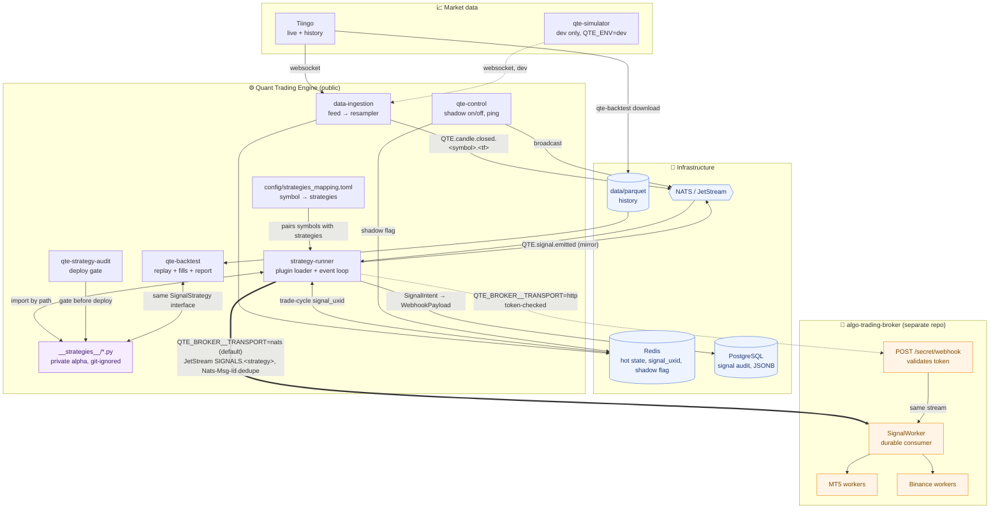

# Quant Trading Engine (QTE)

An event-driven framework for developing, backtesting and running quantitative
trading strategies. The engine is public; **your alpha is not** — strategies
live in `__strategies__/`, which is git-ignored here and cloned from your own
private repository at deploy time.

QTE ingests market data from a pluggable provider (Tiingo ships with it, plus a
dev-only simulator you drive by hand), keeps hot state in Redis, audits every
signal into PostgreSQL, and publishes trade signals over NATS to
[`algo-trading-broker`](https://github.com/rockingrow/algo-trading-broker),
which fans them out to MT5 / Binance workers.

[Quick start](#-quick-start) · [Architecture](#-system-architecture) ·
[Writing a strategy](#writing-a-strategy) · [Backtesting](#backtesting) ·
[Documentation](#-documentation)

---

## ⚡ Quick Start

### 1. Prerequisites

- Python 3.13 — pinned, not a floor: the runner imports your strategy plugins
  into its own process. See `pyproject.toml`.
- [uv](https://docs.astral.sh/uv/)
- Docker & Docker Compose

### 2. Installation

```bash
git clone https://github.com/rockingrow/quant-trading-engine
cd quant-trading-engine

cp .env.example .env          # fill in QTE_DATA_PROVIDER_API_KEY at minimum
make tiingo                   # config/tiingo.toml: which symbols to feed
make install-dev              # uv sync
```

### 3. Drop In a Strategy

`__strategies__/` is git-ignored: it is where your **private** strategy repo is
cloned, whole, so the alpha never lands in this public history.

```bash
git clone <your private strategy repo> __strategies__/my-strategies

make strategy-mount STRATEGY=my-strategies   # install its deps, then audit it
make strategy-mapping                        # config/strategies_mapping.toml — symbol → strategies
make audit                                   # is what the engine sees fit to trade?
```

Nothing private yet? [`__strategies__/_boilerplate/`](__strategies__/_boilerplate/)
is a committed template of exactly what a strategy repo looks like from the
engine's side — `manifest.py`, a strategy class with one method per broker
action, its own `pyproject.toml` and tests. Copy it and start there. Run
`make strategy-mount` at least once either way: the stack refuses to start
without the file it writes.

### 4. Run It

**Production — the whole stack in Docker.**

```bash
make up        # build and start; a one-shot db-migrate container creates the schema first
make logs
```

Signals are built, audited and logged but reach no broker until you point
`QTE_BROKER__*` at
[`algo-trading-broker`](https://github.com/rockingrow/algo-trading-broker) and
turn shadow mode off — see
[Sending signals to the broker](#sending-signals-to-the-broker) and
[Going live](#going-live).

**Development — no vendor key, no market open.**

`make dev` is the same stack with `engines/` bind-mounted for live editing, and
`QTE_MARKET_DATA__PROVIDER=simulator` swaps the vendor for a WebSocket feed you
drive by hand, so the real pipeline runs on invented prices.

👉 [`docs/simulator.md`](docs/simulator.md) is the step-by-step walkthrough.

To measure a strategy rather than run one, go straight to
[Backtesting](#backtesting).

---

## 🏗️ System Architecture



**The seam with `algo-trading-broker`.** QTE stops at the payload; the broker
owns execution. The runner emits exactly the `WebhookPayload` the broker
validates and publishes it onto the same JetStream subject the broker's own
webhook endpoint writes to, so QTE signals arrive through its normal durable,
de-duplicated path. The two repos share one contract and nothing else: no shared
database, no shared process, no import in either direction.

---

## Core concepts

**Event-driven.** Ingestion pushes; the runner reacts to a candle close; the
broker takes signals off a durable stream. Completed candles are staged in a
Redis outbox before publish, and live signals in Postgres before delivery, so
either path recovers with stable de-duplication IDs after a timeout or restart.

**Write once, run anywhere.** A strategy presents one method per broker action
— `long`, `short`, `tp1`, `tp2`, `sl`, plus an optional `r_sl` and `flat` — and
returns `SignalIntent` objects. The backtest replay and the live runner drive
that same interface with the same indicator code, so the file that produced a
backtest curve is the file that trades.

**Plugin / blackbox strategies.** The engine never contains an edge. It loads
strategies out of `__strategies__/` by file path — a mounted volume, not an
installed package — so the public engine and your private algorithms are
versioned and released independently. The contract is *structural*: a strategy
repo may restate `SignalStrategy` and `SignalIntent` on its own side and build,
test and release with this repo nowhere in sight. `qte-strategy-audit` is what
holds that freedom to a standard.

---

## Writing a strategy

A strategy presents **one method per broker action**. Five are required —
`long`, `short`, `tp1`, `tp2`, `sl` — and two are optional: `r_sl` (re-stop:
break-even or trailed) and `flat` (a close that is neither a target nor a stop).

```python
from qte_shared.indicators import atr, crossover, ema
from qte_shared.models import SignalAction
from qte_shared.strategies.strategy_base import SignalIntent, SignalStrategy


class MyEdge(SignalStrategy):
    name = "MT5_GOLD_SCALP"  # ← the NATS subject workers subscribe to
    symbols = ("XAUUSD",)  # ← a default; config/strategies_mapping.toml overrides it
    timeframe = "M15"
    warmup = 220

    def long(self, df, context):
        fast, slow = ema(df["close"], 21), ema(df["close"], 55)
        if not bool(crossover(fast, slow).iloc[-1]):
            return None

        close = float(df["close"].iloc[-1])
        risk = float(atr(df, 14).iloc[-1]) * 1.5
        return SignalIntent(
            action=SignalAction.LONG,
            price=close,
            quantity=0.01,
            sl=close - risk,
            tp1=close + risk * 1.5,
            tp2=close + risk * 3,
            tp1_percent=50.0,
            move_sl_to_be=True,
        )

    # The bracket travels with the entry and the broker's worker manages the
    # exits, so there is nothing to decide per bar. Saying so explicitly is the
    # point of the interface: an absence is not an answer.
    def short(self, df, context):
        return None

    def tp1(self, df, context):
        return None

    def tp2(self, df, context):
        return None

    def sl(self, df, context):
        return None
```

`SignalStrategy` implements `on_candle_closed` — the method the engine actually
calls — for you, by asking those seven in a fixed order:

| Position | Methods asked | Rule |
| --- | --- | --- |
| Holding (`context.open_uxid` set) | `sl` → `r_sl` → `tp1` → `tp2` → `flat` | every one is asked; taking `tp1` and trailing the stop on one bar is normal |
| Flat | `long` → `short` | the first that answers wins — a bar cannot be both |

The stop is asked before any target: if one bar both stopped out and reached a
target, the stop is what happened. A method that returns somebody else's action
— a `tp1()` returning a `SHORT` — raises rather than reaching the broker as a
valid-looking payload. Override `on_candle_closed` yourself if you need a
different order.

**What the framework guarantees, so you do not have to:**

- `df` is an OHLCV frame indexed by candle **open time** in UTC, oldest first,
  and its last row is always a **closed** bar. It never contains a future bar.
- `df` holds `history_window()` bars — `max(warmup * 2, 400)` by default, or
  whatever `max_history` you set. **The live runner uses the same number**, so a
  strategy that reads the whole frame (a running sum, a session VWAP) computes
  the same thing in both places.
- `name` must match the strategy the broker's workers are configured for — it
  *is* the NATS subject they subscribe to. Two strategies sharing a name is a
  loud error at load time and a hard failure in the audit.
- You never publish anything. Return intents; the runner attaches the bracket,
  mints or reuses the trade-cycle id, sends, and audits.
- `on_tick(price, ctx)` is optional. Override it only when an exit has to react
  faster than a bar close — the runner subscribes to ticks only if something does.

---

## How strategies are found

Two ways in, and the loader prefers the first.

**A manifest — for a strategy repository.** A plugin repo declares itself with a
`strategies.py` — or `manifest.py`, the loader takes either — at its root,
exposing `load_all()` returning `{alias: strategy class}`:

```python
# __strategies__/my-strategies/manifest.py
from mine.gold.m5 import GoldEdge

ALIASES = {"MT5_GOLD_M5_SCALP": GoldEdge}


def load_all():
    return dict(ALIASES)
```

The engine imports that one file and asks it what exists — so nothing on this
side knows a module path or a directory layout, the plugin repo reorganises
itself freely, and it decides which of its classes are deployed. A half-finished
experiment sitting in the tree cannot start trading because someone forgot it
was a strategy subclass. **The repo need not import `qte_shared` at all**: the
engine recognises a strategy structurally — a concrete `on_candle_closed`, a
`name`, a `history_window()` — and converts the intents it returns into its own
models. That is what lets a plugin repo run its own lint, test and release cycle
with this one nowhere in sight.

**A directory scan — for a single file.** Failing a manifest, every `.py` under
the directory is imported and anything that looks like a strategy is collected.
Drop a single `.py` file in and it runs, no ceremony.
The scan recurses, skips hidden directories and the usual repo furniture
(`tests/`, `docs/`, `build/`, …) and files starting with `_`. A file that fails
to import is logged and skipped: one broken strategy does not stop the others.

Their dependencies are not automatic — plugins are imported into the runner's
process, so whatever they need is installed alongside the engine:

```bash
make strategy-mount                          # every __strategies__/<name> with a pyproject.toml
make strategy-mount STRATEGY=my-strategies   # just that one: install deps, then audit it
make strategy-test STRATEGY=my-strategies    # run that repo's own suite, in its own venv
make strategies                              # list what the engine can see
make audit                                   # check that what it sees is fit to trade
```

`strategy-mount` records each repo's audit result in
`__strategies__/strategies.toml` — auto-generated, never hand-edited. `make up`
and `make dev` read it to freeze only the audit-passing repos into the image,
and refuse to start without it.

> Why a manifest, why the contract is structural rather than nominal, and why
> the interface is seven methods rather than one:
> [`docs/architecture.md`](docs/architecture.md).

---

## Pairing symbols with strategies

Which strategies trade which symbols lives in
**`config/strategies_mapping.toml`**, not in the code:

```toml
[symbols.XAUUSD]
strategies = ["MT5_GOLD_M5_SCALP"]

# Per-pair overrides. They beat QTE_RUNNER__STRATEGY_PARAMS, so one strategy
# can run tighter on gold than it does on everything else.
[symbols.XAUUSD.params.MT5_GOLD_M5_SCALP]
risk_percent = 1.0

# Parks a symbol without deleting its configuration.
[symbols.EURUSD]
enabled = false
strategies = ["MT5_FX_M15_V1"]
```

```bash
make strategy-mapping   # copy the template into place (never overwrites)
make audit              # verify every name in it against what __strategies__/ publishes
```

**The real file is git-ignored; the example beside it is not.** What you trade,
and at what risk, is position information and this repo is public — so the
schema stays reviewable in history while the book does not. Point
`QTE_ENGINE__MAPPING_FILE` elsewhere to mount it as a secret in production.

With no file at all nothing breaks: each strategy falls back to its own
`symbols` attribute, or to `QTE_ENGINE__SYMBOLS` when it declares none. A file
that exists but maps nothing means *trade nothing*, which is a different thing
and is treated as one.

The runner builds one instance per `(symbol, strategy)` pair, so a strategy
carrying state between bars never has gold's last bar deciding what happens on
bitcoin's next one. A name in the table that nobody publishes is logged as an
error at boot, because the symptom otherwise is a symbol that quietly trades
nothing — which reads exactly like a strategy that found no setups.

---

## Position sizing and the trade cycle

**The engine decides how big every entry is, not the strategy.** A strategy is
never told the balance — that is what keeps a backtested file and a traded file
the same file — so size is settled in one place,
`qte_shared.strategies.sizing`, and both drivers go through it:

```
quantity = QTE_ACCOUNT__CAPITAL x risk_percent / 100 / |entry - stop| / contract_size
```

Read it as *risk this many currency units if the stop is hit*. `risk_percent` is
the pair's own value in `config/strategies_mapping.toml`, falling back to
`QTE_ACCOUNT__RISK_PERCENT`:

```bash
QTE_ACCOUNT__CAPITAL=1000.0          # the account, and what a % of risk is a % of
QTE_ACCOUNT__RISK_PERCENT=1.0        # fallback when a pair states none
QTE_ACCOUNT__COMMISSION_PER_UNIT=0.0 # backtest cost, charged each side
QTE_ACCOUNT__CONTRACT_SIZE=1.0
```

The capital is **fixed for a run**; it does not compound. Sizing off running
equity would make later trades depend on earlier P&L, so two backtests differing
by one early trade could not be compared.

**One trade cycle per (strategy, symbol) at a time.** `signal_uxid` is that
cycle: an entry mints it and every close reuses it, which is how the broker
groups a whole trade into one broadcast. A second entry while one is open is
refused before it reaches the wire, mirroring the worker, which answers
`REJECTED` rather than stacking.

A cycle ends on `TP2`, `SL`, `R_SL` or `FLAT` — **and on a `TP1` that closes the
entry's whole quantity**. Because that decision needs the sizes, the runner
keeps the whole position record in Redis *and* Postgres (`open_positions`), so a
restart mid-trade closes what it opened at the size that is left. See
[`docs/broker-contract.md`](docs/broker-contract.md).

---

## Auditing what you cloned in

The loader is forgiving by design: what it cannot drive it logs and skips, so
one broken file does not stop the other four. That is right for a running
process and useless as a deploy check — "skipped" and "there were none" read
identically in a log until the P&L does not arrive.

`qte-strategy-audit` is the strict pass over the same directory:

```bash
make audit                                   # human-readable, fails on errors
make audit-strict                            # warnings fail too — what CI should run
uv run qte-strategy-audit --format json      # for anything that has to act on it
uv run qte-strategy-audit --format markdown  # for a pull request
```

```
Strategy audit - /app/__strategies__
Mapping table  - /app/config/strategies_mapping.toml

  [FAIL] MT5_GOLD_M5_SCALP  (GoldEdge, via manifest)
         /app/__strategies__/my-strategies/manifest.py
         signals: long, short, tp1, sl
         FAIL MT5_GOLD_M5_SCALP.tp2: required signal method tp2() is not implemented
              -> def tp2(self, df, context) -> IntentResult: return None - an explicit
                 'never' is an answer; an absence is not

1 strategies, 1 errors, 0 warnings
```

It fails a deploy on a strategy that would not load, is missing a signal method,
takes the wrong arity, declares a bad timeframe or warmup, duplicates another's
name, or is named in the mapping table and published by nobody. It warns on a
strategy nothing maps, a directory with no manifest, and an unnamed class. Every
finding carries a `fix`; the exit code is the product.

`__strategies__/` is a bind mount that can be pulled, edited or emptied after CI
ran, so the runner also audits its own book, in its own process, immediately
before it loads anything:

```bash
QTE_RUNNER__AUDIT_ON_START=warn      # log the report, start anyway (default)
QTE_RUNNER__AUDIT_ON_START=error     # refuse to start when the audit found errors
QTE_RUNNER__AUDIT_ON_START=strict    # refuse on warnings too
QTE_RUNNER__AUDIT_ON_START=off       # don't
```

`warn` is the default because it changes nothing about which strategies run: the
loader still skips what it cannot drive, and the report is only there to make
that skipping visible instead of silent. Turning it up to `error` trades a
degraded book for a stopped one — the right call when a half-populated book is
worse than none, the wrong one when four strategies trading beats zero.

---

## Backtesting

```bash
make download                                        # provider history → data/parquet/
make backtest STRATEGY=MY_EDGE SYMBOL=XAUUSD TF=M15
```

or the CLI directly, for the full set of knobs:

```bash
uv run qte-backtest download --symbol XAUUSD --timeframe M15 --start 2023-01-01
uv run qte-backtest list
uv run qte-backtest run --strategy MY_EDGE --symbol XAUUSD --spread 0.30 --persist
```

A run starts from `QTE_ACCOUNT__CAPITAL` (default **$1,000**) and prices its
fills with `QTE_ACCOUNT__COMMISSION_PER_UNIT`, so P&L, max drawdown and profit
factor are figures about a real balance rather than about one arbitrary unit.
Entries are risk-sized against that capital exactly as the live runner sizes
them, and the pair's overrides in `config/strategies_mapping.toml` apply here
too — so a backtest measures the book you actually configured. `--persist`
writes the run and every trade into Postgres.

```
Capital           1,000.00 → 1,378.79   (+37.88%)
Net PnL           378.79   (fees 0.00)
Profit factor     1.294
Max drawdown      243.31  (18.50%)
```

The fill simulator is deliberately pessimistic — it is meant to disprove a
strategy, not flatter one:

- entries and exits cross the spread and pay slippage;
- when a bar's range covers both the stop and the target, the **stop** is taken
  (without tick data there is no ordering, and assuming the good one is how a
  losing strategy backtests profitably);
- a gap through a level fills at the bar's open, not at the level;
- a second entry while a position is open is **rejected**, mirroring the worker;
- a position still open on the last bar is marked out, so unrealised P&L cannot
  quietly flatter the report.

### The report

`--report` writes a JSON artefact for an agent to analyse plus a Markdown
companion for a human — same object, two renderings:

```bash
uv run qte-backtest run --strategy MY_EDGE --symbol XAUUSD --report
# → data/reports/MY_EDGE_XAUUSD_M15_20260823T150404Z.{json,md}
```

Beyond the headline metrics it carries what makes a result diagnosable: every
statistic in **R-multiples** as well as currency, **MAE/MFE per trade** (how far
price went against and for the position while it was open), each partial exit
leg, and the exact broker payloads the run would have published.

The part worth having is `diagnostics` — a rule set that reads the finished run
and says what is wrong with it. Each finding states the threshold it tripped,
carries the numbers that tripped it, and proposes one concrete change:

```
Diagnostics       2 critical, 1 info
  [CRITICAL] EXITS_NEVER_TRIGGER: 1/1 exits were forced by the end of the data
             → Print entry, sl, tp1 and tp2 for the first trade and check the
               distances against the instrument's typical bar range. A stop
               should be a small multiple of ATR, not a multiple of price.
```

`report.is_trustworthy` is false whenever anything critical fired, so an agent
knows to stop reading the metrics as meaningful. The rule table and the JSON
schema are in [`docs/backtest-report.md`](docs/backtest-report.md).

### Seeing it

`qte-backtest chart` renders a report into one self-contained HTML page, laid
out like a strategy tester — the layout every discretionary trader already
reads:

```bash
make chart REPORT=data/reports/MY_EDGE_XAUUSD_M15_20260823T150404Z.json
uv run qte-backtest run --strategy MY_EDGE --symbol XAUUSD --report --chart
```

The equity curve against buy-and-hold, the price window with every trade marked
on it, P&L by period, the returns distribution, streaks, run-ups and drawdowns,
MAE/MFE against realised R, the diagnostics and the full sortable trade list.

It fetches **nothing** when it opens — stylesheet, script and data are inlined,
so a report opens on a machine with no network. It takes the **JSON and nothing
else**, so a run from three months ago still draws without its history or its
strategy. And it **invents nothing**: statistics that need data the replay never
had — intrabar equity, margin, liquidation — are absent rather than
approximated.

---

## Rehearsing the live path (dev only)

A backtest replays history through a strategy. It does not exercise the socket,
the resampler, Redis, NATS, the runner's warm-up or the broker sink — which is
most of what runs in production and all of what breaks at 3am.

`qte-simulator` is a WebSocket server that speaks a market feed. `data-ingestion`
connects to it exactly as it connects to a vendor, so the pipeline under test is
the real one and only the prices are invented:

```bash
QTE_MARKET_DATA__PROVIDER=simulator   # the whole switch

make sim                              # the feed
qte-simulator tick   --symbol XAUUSD --bid 2400.0 --ask 2400.4
qte-simulator replay --symbol XAUUSD --generate 300 --seed 7 --verify --expect-signal
qte-simulator walk   --symbol XAUUSD --rate 5
```

A bar is not published as a candle — it is expanded into the ticks a bar is made
of, and ingestion's own resampler rebuilds it. `--verify` then subscribes to the
closed-candle subject and compares what came back, field by field, exiting
non-zero on a mismatch:

```
Played 300 XAUUSD M15 bars as 1201 ticks → 1 feed client(s)

Verify  300/300 candles republished by ingestion
Signals 1 emitted on XAUUSD
  QTE_EXAMPLE_EMA_ATR LONG price=2525.638811 qty=0.01 sl=2504.94991 [shadow]
```

**It refuses to run outside `QTE_ENV=dev`, and so does the provider that reads
it** — checked before the server binds a port, with no override flag. A
simulator looks exactly like a feed, so an engine wired to one in production
would trade fabricated prices and log nothing unusual doing it. Compose keeps it
behind the `dev` profile for the same reason: alongside a real feed, one symbol
would have two sources.

👉 The step-by-step, including what to check when a candle does not arrive:
[`docs/simulator.md`](docs/simulator.md).

---

## Sending signals to the broker

QTE emits exactly the payload `algo-trading-broker` validates — its
`WebhookPayload`: `strategy`, `symbol`, `timeframe`, `timestamp`,
`signal_uxid`, a `position` block, `indicators`, `inputs`, `token`. Two
transports carry it, selected with `QTE_BROKER__TRANSPORT`:

| | `nats` (default) | `http` |
| --- | --- | --- |
| Destination | JetStream `SIGNALS.<strategy>` | `POST /secret/webhook` |
| Why | The broker's own webhook endpoint writes to that same stream, so we inherit its persistence, retry and de-duplication with no HTTP hop in the trade path. | Slower, but it is the path that verifies the `token` field. |
| Auth | Access to the NATS cluster **is** the authentication. | `QTE_BROKER__TOKEN`, matched against the broker's. |
| Use when | QTE and the broker share a trusted/private NATS cluster. | Anything crosses a boundary you do not control. |

Each publish carries a fresh `Nats-Msg-Id`, so a retried publish inside the
stream's duplicate window is stored once and a worker opens one position.

> The engine also mirrors every emitted signal on `QTE.signal.emitted` and rows
> it into Postgres, whether it was delivered, shadowed or failed.

---

## Operating a running engine

There is no web service. The one control that genuinely has to reach a *running*
process is shadow mode — the live/paper switch, which must not require
restarting a runner mid-position — and it travels on NATS like every other
engine event:

```bash
uv run qte-control shadow status   # is it paper or live right now?
uv run qte-control shadow on       # pause delivery to the broker
uv run qte-control shadow off      # GO LIVE — prompts unless you pass --yes
uv run qte-control ping            # which runners are up, and in what mode
```

The flag is written to Redis first and broadcast second, so a runner that starts
*after* the broadcast still comes up in the mode you last chose. If NATS is
unreachable the command says so explicitly rather than reporting success.

Everything else the engine knows is a CLI command or a SQL query:

| Want | Do |
| --- | --- |
| Signal audit trail | `SELECT * FROM signals ORDER BY created_at DESC LIMIT 20` |
| One trade cycle end to end | `SELECT * FROM signals WHERE signal_uxid = '…' ORDER BY created_at` |
| What strategies are loaded | `make strategies` |
| Look at a report | `make chart REPORT=data/reports/….json`, then open the HTML |
| Rehearse the live path | `make sim`, then `qte-simulator replay …` (dev only) |

---

## Database

Alembic owns the schema. There is no init script — one would only ever run on an
empty volume, which is exactly the case a migration tool exists to outgrow.

```bash
make db-upgrade                     # apply everything pending
make db-current                     # where is this database?
make db-revision M="add a column"   # autogenerate from model changes
make db-check                       # fail if the models have drifted
make db-downgrade                   # back out one revision
```

**Each engine owns the tables it writes**, with its models and repositories in
its own `db/` package:

| Package | Tables |
| --- | --- |
| `qte_strategy_engine.db` | `signals` |
| `qte_backtest.db` | `backtest_runs`, `backtest_trades` |
| `qte_shared.db` | `engine_events` |

They all share one `DeclarativeBase`, because Alembic diffs the database against
`Base.metadata` and a model on a different base would be invisible to
autogenerate. For the same reason, adding an engine that owns tables means
adding its `models` import to `migrations/env.py`; `tests/test_db_layout.py`
enforces both. The schema needs no PostgreSQL extensions.

---

## Deployment

```bash
# 1. Public engine
git clone https://github.com/rockingrow/quant-trading-engine
cd quant-trading-engine && cp .env.example .env   # then edit it

# 2. Private alpha, into the ignored directory
git clone git@github.com:you/my-private-strategies.git __strategies__/my-strategies

# 3. Its dependencies, which the runner imports into its own process
make strategy-mount STRATEGY=my-strategies
make strategies                      # confirm the engine can see them

# 4. Say what to feed and what trades it, then check the whole thing
make tiingo                          # config/tiingo.toml — symbols, timeframes, vendor knobs
make strategy-mapping                # config/strategies_mapping.toml, git-ignored — edit it
make audit-strict                    # fails on anything the runner would skip

# 5. Up. `make up` freezes the plugin repos' requirements into deploy/ first,
#    and a one-shot db-migrate container creates the schema before the services
#    start.
make up
make logs
```

Each service builds its **own image**: `QTE_PACKAGE` selects one workspace
member, so the ingestion container does not carry pyarrow (152 MB, backtest
only) or the backtest engine at all. A full-workspace venv is 352 MB; each
service's is ~142 MB. The backtest CLI is deliberately in no container —
replaying history is done on the host, not inside the live trading process.

`docker-compose.yml` ships a `nats` service for standalone development. In
production you normally point `QTE_BROKER__NATS_URL` at the **broker's** NATS,
because that is where the `SIGNALS` stream its workers consume actually lives —
publishing to a second cluster means nobody ever receives the signals.

### Going live

1. **Backtest** until the numbers hold up.
2. **Shadow mode** — `QTE_BROKER__SHADOW_MODE=true` (the default). Ingestion and
   strategies run, signals are built, logged and audited, and nothing reaches
   the broker.
3. **Reconcile** — read the `signals` table and check the entries and exits
   against the chart. Filtering by `signal_uxid` gives you one trade end to end.
4. **Go live** — `make shadow-off`. It takes effect on every running runner
   immediately, and the flag is stored in Redis so a restart comes up in the
   mode you last chose.

`make shadow-on` puts it back. That is the kill switch; keep it to hand.

---

## 📚 Documentation

The long-form pages this README deliberately stays out of, all under
[`docs/`](docs/):

| Document | What is inside | Reach for it when |
| --- | --- | --- |
| 🧭 **[Architecture notes](docs/architecture.md)** | Twenty "Why X" sections on the decisions that are easy to reverse by accident — the two NATS namespaces, bars closing on the clock, the structural plugin contract, one image per service. | You are about to change something and want to know what it was protecting. `rg -n '^## ' docs/architecture.md` is the index. |
| 🤝 **[Broker contract](docs/broker-contract.md)** | Every field of the `WebhookPayload` QTE sends, the trade-cycle rules around `signal_uxid`, and what the broker does with each action. | You are wiring up `algo-trading-broker`, or a signal came back rejected. |
| 📊 **[Backtest report](docs/backtest-report.md)** | The JSON schema, the Markdown and HTML renderings of the same object, the R-multiple and MAE/MFE conventions, and the full diagnostics rule table. | You are reading a report — or writing something that reads one. |
| 🧪 **[Simulator walkthrough](docs/simulator.md)** | A fresh clone to a closed candle and an emitted signal, on one machine: the `.env`, the stack, driving the feed step by step, and what to check when no candle arrives. | You want to rehearse the live path with no vendor key and no market open. |

Two more sit in the repository root: [`AGENTS.md`](AGENTS.md) — the working
rules every contributor and coding agent follows — and [`AUDIT.md`](AUDIT.md),
the conventions those rules are checked against.
